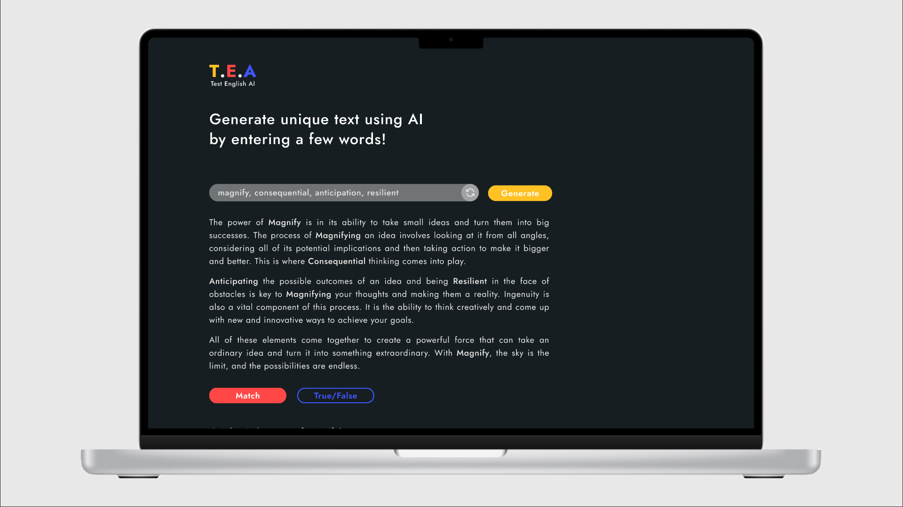

# Description

It makes use of the state-of-the-art Jurassic-1 language models to generate reading test accordingly to the seqence of words or phrases (or without) divided by coma.

A web application 'T.E.A' or 'Test English AI' as English-study-helper is designed for students and English learners studying for English language proficiency tests such as TOEFL, IELTS, Cambridge etc and offers personalized reading test preparation with AI-generated texts and various tasks options to them. 

Say goodbye to same-type texts and drilling essential vocabulary into your head and get acquainted with practical exercises that are aimed at improving your specific skills and expanding your vocabulary. Acquiring essential vocab is carried out through completing selected type of tasks on specially generated texts, based on the user-specified sequence of words.

All generated texts and tests to them were specifically trained on IELTS academic and general reading tasks in order to bring the user closer to real English exam assignment and improve its performance in it.

Primarily built with React.js. Site makes use of the state-of-the-art Jurassic-1 language models.

## Getting Started
1. Clone the repository 

`git clone https://github.com/DanyaVer/test-english-ai.git`

2. Navigate to cloned folder

`cd ai-reading-exam`

3. Install dependencies

`npm install`

4. Start the app in your local environment

`npm start`

5. Open [http://localhost:3000](http://localhost:3000) to view it in the browser.

## Play

0. Open [https://test-english-ai.danyaver.repl.co/](https://test-english-ai.danyaver.repl.co/) to interact.
 

1. Write a sequence of words (you can reset the written sequence by clicking on the icon button on the right of the input field) and press the "Generate" button, which will invoke the generateText() function. This function sends an API request to the `/complete` endpoint of the Jurassic-1 Grande model. The main request includes a "one shot" `prompt` parameter with a value that prompts the model to generate a new made-up text related to words. Other parameters worth noticing are `maxTokens`, `temperature`, and `stopSequences`.
 

2. Once the model returns a response, it is rendered below the Input Field and "Generate" button as text with latin letters prior to each paragraph.
 

3. Then you can see two buttons below: "Headings" and "True/False/Not given". When clicked, each shows tasks for the module it represents. Every sentence there is generated for one paragraph which is used in prompt value in another two API request to Jurassic-1 Grande.
 

4. After answering these questions, you can click the "Submit" button and it'll check your answers, color every select object either as correct or wrong one, and in the bottom will be created two additional lines with results for each category.

## Contribute

This is a submitted project to AI21 Labs AIHacathon on the platform AI. 
Your contributions are welcome!

Made by the team The Think Tank

